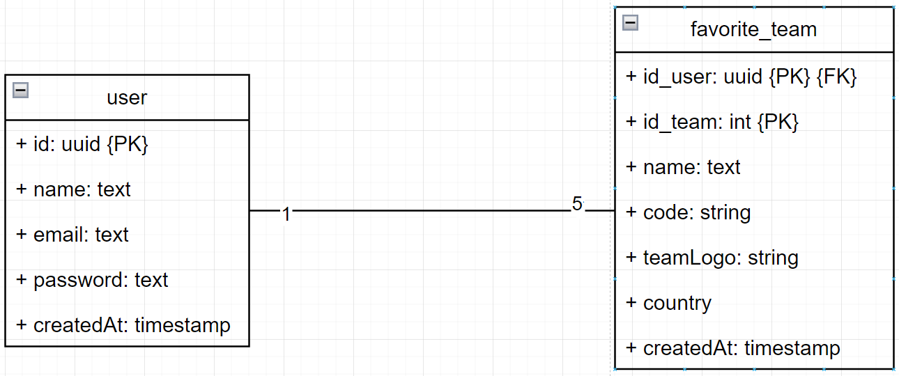
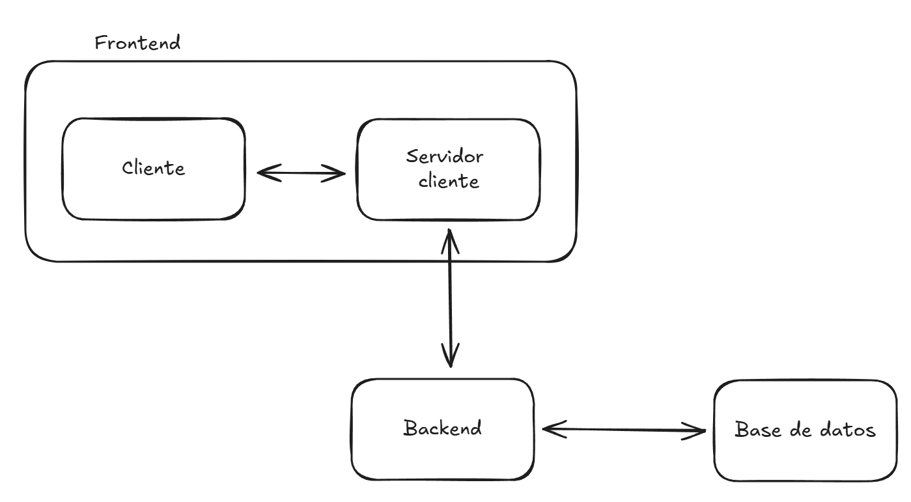

# Football Hub

Football Hub es un proyecto que permite visualizar los partidos de tus equipos favoritos. Cuenta con las siguientes funcionalidades:

- Registro y login de usuarios.
- Búsqueda de equipos por nombre.
- Seleccionar hasta 5 equipos favoritos.
- Visualizar próximos partidos de un equipo seleccionado.
- Visualizar información detallada del partido.

## Versiones recomendadas y requisitos

- **Node**: v22.15.0.
- **NPM**: v10.9.2.
- **Docker**: v20.10.17.
- **Docker Compose**: v1.29.2.

## Proyecto

El proyecto está organizado como un monorepo, con dos workspaces:

- `packages/frontend`: frontal de la aplicación.
- `packages/backend`: servicio de la aplicación.

## Utilización y configuración

### 1. Variables de entorno

En primer lugar, es imprescindible configurar los ficheros `.env` del proyecto. En este caso, existen tres:

- En la raíz del proyecto.
- En cada uno de los workspaces.

Para cada `.env` a configurar existe su `.env.example`. Se deben de rellenar las variables indicadas en cada uno con los valores deseados.

**IMPORTANTE**: Se debe de obtener una API Key para el uso de la API Football que consume el proyecto. Puedes conseguirla [aquí](https://dashboard.api-football.com/).

### 2. Instalación

En la raíz del proyecto, ejecutar el siguiente comando:

```bash
npm install
```

### 3. Base de datos

Levanta la base de datos ejecutando lo siguiente:

```bash
docker-compose up -d db
```

A continuación, vuelca las migraciones:

```
npm run prisma:migrate
```

### 4.a Levantar los servicios en local (modo desarrollo)

Para levantar los servicios (frontend y backend) en modo desarrollo, ejecuta lo siguiente de manera secuencial en la raíz del proyecto:

```bash
npm run dev:backend
```

```bash
npm run dev:frontend
```

### 4.b Levantar los servicios en local (modo producción) (RECOMENDADO)

Para levantar la plataforma en modo producción, se recomienda el uso de `docker`. Para ello, ejecutar lo siguiente en la raíz del proyecto:

```bash
docker-compose up -d --build
```

### 5. Acceso a la plataforma

Con todo ya levantado, se debería de poder acceder al frontal en http://localhost:4321, en caso de que se haya mantenido el contenido de ejemplo para las variables de entorno.

### 6. Cambio de puerto

En caso de querer cambiar el puerto de alguno de los servicios, se debe de modificar a su vez el `docker-compose.yml` para configurar el acceso en modo producción.

### 7. Tests

Existen test unitarios en el workspace del backend. Para ejecutarlos, ejecutar en la raíz:

```bash
npm run test:backend
```

Para obtener el coverage de los ficheros, ejecutar en la raíz:

```bash
npm run coverage:backend
```

## Tecnologías

El proyecto cuenta con las siguientes tecnologías y librerías.

### Desarrollo

- [ESLint](https://eslint.org/): linter para formateo de código y buenas prácticas.
- [Prettier](https://prettier.io/): librería para formateo de código.
- [Husky](https://typicode.github.io/husky/): para lanzar scripts concretos a la hora de hacer un commit. En este caso, formateo de código.
- [Lint staged](https://github.com/lint-staged/lint-staged): permite lanzar tareas asociadas a husky en ficheros en estado _staged_.
- [TypeScript](https://www.typescriptlang.org/): lenguaje de programación.

### Frontend

- [NextJS](https://nextjs.org/): framework de React (v15).
- [React](https://es.react.dev/): librería para construcción de sitios web (v19).
- [shadcn/ui](https://ui.shadcn.com/): librería de UI que provee de componentes ya construidos.
- [TailwindCSS](https://tailwindcss.com/): framework CSS (v3).

### Backend

- [NestJS](https://docs.nestjs.com/): framework para creación de servicios (v11).
- [Prisma](https://www.prisma.io/): ORM para comunicación con base de datos y gestión de migraciones (v6).
- [Jest](https://jestjs.io/): liberaría para la ejecución de test unitarios.
- [JWT](https://jwt.io/): libererías y concepto general y estandarizado para la creación de tokens de acceso para los usuarios.
- [Bcrypt](https://www.npmjs.com/package/bcrypt): paquete para la creación de hash de contraseñas.

### Herramientas externas

- [Docker](https://www.docker.com/): gestión contenerizada del proyecto para uso en producción y uso de la base de datos.
- [PostgreSQL](https://www.postgresql.org/): base de datos relacional.

## Arquitectura

### MER

El MER (Modelo Entidad-Relación) es el siguiente:



Existen dos entidades:

- `user`: Almacenamiento de los datos de usuarios:
    - `id` como PK (Primary Key) autogenerada.
- `favorite_team`: Almacenamiento de equipos favoritos e información de dichos equipos.
    - `id_user` (id del usuario) e `id_team` (id del equipo) como PK.
    - `id_user` como FK (Foreign Key) para relación con el usuario.
    - `id_team` es el mismo que viene al obtener el equipo desde la API, por lo que no es autogenerado.

Existe, a su vez, una relación entre ambas entidades de tipo uno a cinco, donde un usuario puede tener hasta 5 equipos favoritos.

### Diagrama de arquitectura



### Backend

- El servicio se comunica con la BBDD relacional a través de uso de Prisma.
- El servicio se integra con una API externa ([API Football](https://www.api-football.com/documentation-v3#section/Introduction)) para obtención de nombres de equipos, actuando en este caso como un proxy, formateando la respuesta y adaptándola al contrato con el front.
- Expone una serie de endpoints en función del tipo de información o acción a realizar:
    - `auth`: gestión de la autenticación.
    - `favorite`: equipos favoritos.
    - `fixtures`: partidos.
    - `teams`: equipos.

### Frontend

- El frontend se integra con el servicio para obtención de información.
- Para evitar exponer la URL del servicio, se emplea el backend de NextJS como proxy. De este modo, aportamos seguridad al sistema.
    - Las peticiones se realizan a este servidor de NextJS.
    - Son redirigidas al servicio backend.
    - Evitamos así exponer la URL del backend como variable de entorno en el cliente.

## Organización de código, patrones y buenas prácticas

Cada workspace sigue una serie de pautas organizativas. De manera común, se aplica:

- `kebab-case` para nomenclatura de ficheros.
- Se tratan de aplicar de manera general los principios [SOLID](https://es.wikipedia.org/wiki/SOLID).
- Aplicación del principio [DRY](https://en.wikipedia.org/wiki/Don%27t_repeat_yourself).
- Modularización de ficheros y uso de `index.ts(x)` frente a nombre del módulo. Esto facilita el testing y legibilidad, así como las importaciones y exportaciones.

### Backend

- `controllers`: controladores, punto de entrada del servicio que gestionan las peticiones en función de método y ruta.
- `providers`: servicios, proveen de funcionalidades a los controladores o a otros servicios.
- `repository`: aportan funciones para extraer la comunicación con la base de datos asociada a una tabla o entidad concreta. Seguiría en este caso el patrón de diseño [Repository](https://medium.com/@pererikbergman/repository-design-pattern-e28c0f3e4a30).
- `guards`: proveen de funcionalidad común para controlar el acceso a determinadas rutas.

### Frontend

En este caso, se aplica el patrón de diseño [Atomic Design](https://medium.com/@janelle.wg/atomic-design-pattern-how-to-structure-your-react-application-2bb4d9ca5f97), que se fundamenta en las siguientes partes:

- `pages`: son las páginas, los elementos en el nivel más alto del sistema. En este caso, sería la carpeta `app`, debido al uso de `NextJS`.
- `layouts`: plantillas comunes que envuelven una vista.
- `views`: vistas que componen las páginas.
- `componentes`: elementos mínimos que pueden ser reutilizados en diferentes vistas.

A su vez, existen:

- `services`: servicios para fetch de datos.
- `hooks`: funciones de tipo hook con funcionalidades comunes y reutilizables.
- `app/api`: expone una serie de puntos de acceso para hacer peticiones en el propio servidor del frontend. Sería, por lo tanto, el proxy para comunicación con el servicio.
